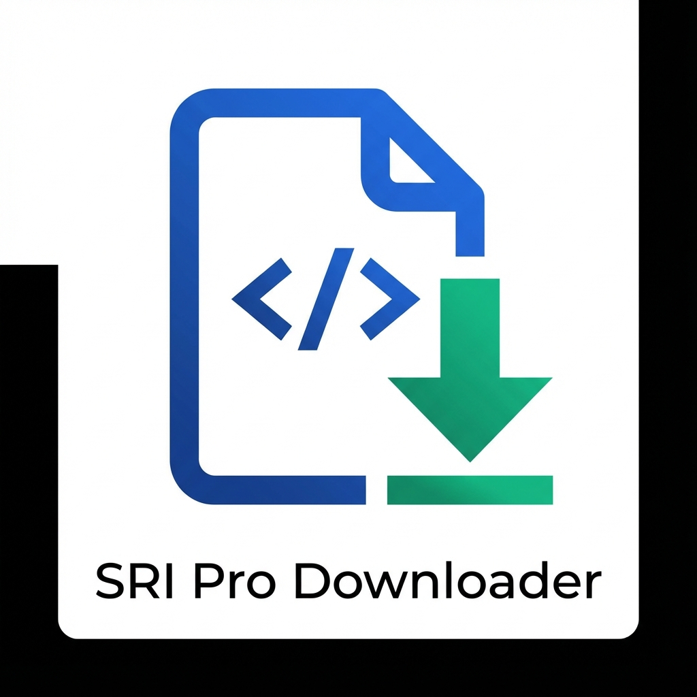

# SRI Pro Downloader 🇪🇨



**SRI Pro Downloader** es una extensión profesional para Google Chrome diseñada para facilitar la descarga masiva y gestión de comprobantes electrónicos (XML) desde el portal del SRI en Línea (Ecuador).

## 🚀 Características

- **Descarga Masiva**: Descarga múltiples facturas XML con un solo clic.
- **Renombrado Inteligente**: Guarda tus archivos automáticamente con el formato `RUC_FECHA_SECUENCIAL.xml`.
- **Organización Automática**: Configura una carpeta específica (ej: `Facturas/2025`) para mantener tus descargas ordenadas.
- **Exportación a Excel**: Genera reportes CSV de tus comprobantes al instante.
- **Dashboard**: Visualiza rápidamente el número de facturas y el monto total en pantalla.
- **Modo Oscuro/Moderno**: Interfaz limpia y agradable a la vista.

## 🛠️ Instalación

1. Descarga el código de este repositorio (ZIP) o clónalo:
   ```bash
   git clone https://github.com/jonavez/sri-pro-downloader.git
   ```
2. Abre Google Chrome y ve a `chrome://extensions/`.
3. Activa el **"Modo de desarrollador"** en la esquina superior derecha.
4. Haz clic en **"Cargar descomprimida"**.
5. Selecciona la carpeta donde descargaste/clonaste este proyecto.

## 📖 Cómo Usar

### 1. Escanear Facturas
- Ingresa al portal del SRI en Línea -> Facturación Electrónica -> Comprobantes Recibidos.
- Realiza tu consulta (por mes, año, etc.).
- Haz clic en el icono de la extensión **SRI Pro Downloader**.
- Presiona el botón **"🔍 Escanear Página Actual"**.

### 2. Descargar XMLs
- Una vez escaneadas, verás el total de facturas y el monto.
- Presiona **"⬇️ Descargar XMLs"** para bajar los archivos de la página actual.
- O usa **"📑 Descargar Todas las Páginas"** para procesar automáticamente la paginación del SRI.

### 3. Configurar Carpeta de Descarga
- Haz clic en el icono de engranaje (⚙️) en la extensión.
- Escribe el nombre de la carpeta deseada (ej: `Mis Facturas/Enero`).
- **Importante**: Para evitar que Chrome te pregunte dónde guardar cada archivo, ve a `chrome://settings/downloads` y desactiva la opción *"Preguntar dónde se guardará cada archivo"*.

## ⭐ Contribuye y Apoya

Si esta herramienta te ha sido útil y te ha ahorrado tiempo, ¡te agradecería mucho tu apoyo!

- **Dale una estrella ⭐** a este repositorio en GitHub. ¡Me ayuda mucho a llegar a más personas!
- Si encuentras un error o tienes una idea para mejorarla, por favor abre un [Issue](https://github.com/jonavez/sri-pro-downloader/issues) en la sección correspondiente.

## 📬 Contacto

¿Necesitas ayuda personalizada o tienes alguna sugerencia directa?

- **Web/Contacto**: [https://pid.la/jona](https://pid.la/jona)
- **GitHub**: [Jonathan Chavez](https://github.com/jonavez)

---
Desarrollado con ❤️ por [Jonathan Chavez](https://github.com/jonavez).
